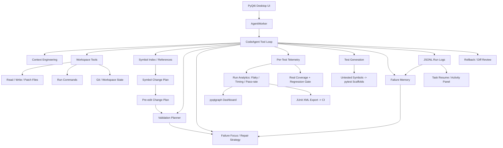

# KAgent Resume Project Showcase

## Project Positioning

KAgent is a local desktop Coding Agent and test-development automation assistant. It is built for code understanding, workspace editing, command execution, automatic validation, failure repair, run-log replay, agent behavior auditing, and per-test telemetry / quality analytics.

For resume usage, position it as:

> A local AI coding assistant for test-development workflows, focused on safe code modification, symbol-level impact analysis, automatic validation, per-test telemetry (flaky / timing regression), CI export, real coverage gating, and test generation — backed by reproducible run logs.

This single project serves BOTH a 测试开发 / 游戏测试开发 role (test-platform depth) AND an AI/Agent engineering role (ReAct agent + code intelligence + context engineering + test-failure memory), which is its key differentiator versus single-direction portfolios.

## Resume Title

```text
KAgent Local Coding Agent and Test Automation Assistant
AI Engineering Tool / Test Development Tooling
```

Chinese resume version:

```text
KAgent 本地代码 Agent 与测试开发自动化助手
AI 工程工具 / 测试开发工具方向
```

## Technology Stack

- Python, PyQt6, SQLite
- OpenAI-compatible Chat Completions API
- Python AST, lightweight multi-language symbol scanning (JS/TS, Go, Rust, Java)
- JSON Schema style tool definitions
- JSONL run logs (per-test telemetry, symbol impacts, change plans, model lifecycle)
- pyqtgraph visual analytics dashboard
- coverage.py real coverage measurement + regression gate
- TF-IDF test-failure memory (offline, no external embedding dependency)
- Pytest, py_compile, project validation scripts
- Git, rollback records, diff review

## Architecture



## Core Workflow

When the user asks KAgent to change code, the Agent can run this loop:

1. Understand the task and inspect project context.
2. Locate files, functions, classes, imports, and references.
3. Build a symbol-level change plan before editing.
4. Generate an edit change plan with risk and validation hints.
5. Apply a patch or write files.
6. Run syntax checks, symbol-related tests, file-related tests, and full validation.
7. Capture per-test results (pytest --junitxml) into the run log as `test_case_result` events.
8. If validation fails, focus on failure locations and impacted symbols; recall similar past failures from the test-failure memory.
9. Summarize changed files, impacted symbols, validation results, and residual risk.
10. Write a JSONL run log for replay, debugging, task resume, and cross-run analytics.

## Highlights For Resume

### Test-Platform Pillar (测试开发)

- Implemented per-test telemetry: automatic direct pytest validation appends a temporary `--junitxml`, parses it, and writes one `test_case_result` run-log event per test (nodeid, status, duration_ms, failure_type, file), so analytics reason about individual tests instead of only command exit codes.
- Built flaky-test detection: cross-run per-nodeid pass/fail history (failure-priority within a run so a passing retry does not erase the flake), distinguishing a flaky test (intermittent pass/fail) from a persistent regression (fails every run) and a stable test.
- Built timing-regression detection: per-nodeid cross-run duration history with a median baseline, flagging tests whose latest duration jumped above a ratio + absolute-delta threshold with a slower/faster/stable trend, plus validation-command duration trends.
- Rendered a visual analytics dashboard with pyqtgraph (pass-rate time-series + flaky-test table + timing-regression table) replacing a markdown text report, with a graceful fallback to text when pyqtgraph is unavailable.
- Exported standard JUnit XML (one testcase per per-test result with failure/error/skipped, or a run-level testcase when no per-test data), closing the consume-only asymmetry so the telemetry feeds Jenkins/GitLab/Unity-CI.
- Measured real coverage with coverage.py, persisted coverage history, and added a regression gate (warns on a sustained drop); validation ranking now rewards full-suite commands by real measured coverage instead of a hardcoded label bonus — fixing a fake metric.
- Added test-generation tools: `list_untested_symbols` finds the coverage gap (production symbols with no mapped test file), and `scaffold_test_for_symbol` drafts a collectible pytest scaffold with TODO placeholders (no fake assertions).
- Hardened the quality gate: unified the runtime gate (shown in run history / Run Analytics trends) and the post-hoc review gate to the same check codes (run_completed / changes_validated / validation_passed / tool_failures_recovered / coverage_regression), so a run's gate status no longer disagrees between the history table and the review report; wired the coverage regression gate into it so a coverage drop actually downgrades the gate (closing the "coverage measured but never gated" gap).
- Added a static-analysis gate (ruff + mypy) to the verify pipeline alongside compileall + pytest — ruff caught a real latent bug on first run (a path used `re` without importing it) plus unused imports/variables, and mypy runs in a lenient mode so the gate stays green without a full annotation pass. Together with runtime tool-argument JSON-Schema validation, this forms a "three-layer gate": input-contract (schema) + type-contract (mypy) + runtime quality (quality gate with coverage).

### AI-Agent Pillar (AI 工程)

- Built a ReAct Agent tool-call loop (think → tool → result → multi-step) with 22+ tools, JSON-Schema definitions, risk classification, permission approval, failure classification, and retry.
- Built multi-language symbol-level code intelligence: Python AST + lightweight JS/TS, Go, Rust, Java symbol discovery, references, change plans, impact scores, and risk summaries.
- Implemented context engineering: water-level context compression, per-tool output truncation with omitted counts, workspace project-memory injection, and cross-session rolling summaries folded back into the prompt.
- Built a test-failure memory (RAG variant): indexes per-test failures joined with symbol impacts and change plans, recalls similar historical failures by TF-IDF + cosine similarity (offline, no embedding API), with an honest `insufficient_corpus` guard when run history is too thin.
- Implemented safety mechanisms: command-risk classification, pre-edit change plans, patch-failure recovery, tool-call loop detection, selective rollback, final trust checks, and runtime tool-argument validation against the declared JSON-Schema (required / type / additionalProperties enforced before dispatch).

## Test Development Angle

This project is especially suitable for a 测试开发 / 游戏测试开发 resume because it demonstrates:

- A complete test-platform loop: per-test telemetry → flaky/timing detection → visual dashboard → CI export → real coverage gating → test generation.
- A "three-layer gate" engineering practice: input-contract (tool-argument JSON-Schema validation) + type-contract (mypy) + runtime quality (unified quality gate with coverage regression), with ruff+mypy wired into the verify pipeline — ruff's first run caught a latent bug pytest missed.
- Test reliability (flaky detection), regression detection (timing + coverage gates), and CI integration (JUnit XML) — keywords test-dev recruiters actively screen for.
- Failure diagnosis and repair-loop design, with a test-failure knowledge base for triage.
- Reproducible, replayable run logs and quantified quality gates.
- AI-assisted test engineering (auto-generated test scaffolds, symbol-driven test selection).

It can replace the RenderDoc Agent project if the resume needs stronger AI/tooling depth. Keep RenderDoc, Perfeye, PIX, memory snapshot, and frame capture keywords in internship experience and skills, while using KAgent as the main AI engineering project.

## Suggested Resume Bullet Version

```text
KAgent 本地代码 Agent 与测试开发自动化助手
AI 工程工具 / 测试开发工具方向

- 基于 Python + PyQt6 + OpenAI API 实现本地 Coding Agent，支持项目读取、代码修改、命令执行、自动验证、运行日志复盘和任务恢复。
- 设计 ReAct 工具调用循环，封装 read_file、apply_patch、run_command、validation_plan、symbol_change_plan、measure_coverage、recall_similar_failures 等 22+ 工具，实现"理解需求 -> 修改代码 -> 验证 -> 总结"闭环。
- 实现用例级测试遥测：自动验证遇到直接 pytest 时追加临时 --junitxml，解析后按 nodeid 持久化每条用例的 pass/fail/耗时/失败类型到运行日志。
- 实现 flaky 检测（按 nodeid 跨运行 pass/fail 历史，失败优先避免重跑抹信号，区分持续回归与间歇 flaky）与耗时回归检测（中位数基线 + 倍数/增量双阈值 + 趋势方向）。
- 用 pyqtgraph 把运行趋势分析从 markdown 文本升级为 pass-rate 时序折线 + flaky/耗时回归表的可视化看板。
- 导出标准 JUnit XML 供 Jenkins/GitLab/Unity-CI 消费，闭合"只消费不产出"的不对称。
- 用 coverage.py 量真实覆盖率并加回归 gate，修掉验证排序里写死的假覆盖率指标。
- 实现测试生成：扫描"有产线引用但零测试"的符号，自动生成可被 pytest 发现的脚手架。
- 硬化质量门：统一运行时门与复盘门为同一套检查码（消除历史表与复盘结论不一致），把覆盖率回归接进门禁；加 ruff + mypy 静态门与运行时工具参数 JSON-Schema 校验，形成"三层门禁"（输入契约 + 类型契约 + 运行质量），ruff 首跑即抓到一个 pytest 漏掉的潜在 NameError bug。
- 实现多语言符号索引、符号引用分析与符号级变更计划，修改函数/类前分析定义、引用、相关测试与风险；实现上下文工程（水位压缩 + 工具输出截断 + 项目记忆 + 跨会话摘要）。
- 实现测试失败记忆（TF-IDF 语义召回历史相似失败及变更意图，运行历史过薄时诚实返回 insufficient_corpus）、编辑前变更计划、风险策略、Patch 失败恢复、选择性回滚和最终可信度检查。
技术栈：Python、PyQt6、OpenAI API、AST、SQLite、Pytest、coverage.py、pyqtgraph、jsonschema、mypy、ruff、JSONL、Git
```

## Short Resume Version

```text
- 基于 Python + PyQt6 + OpenAI API 实现本地 Coding Agent，支持代码读取、修改、命令执行、自动验证与运行日志复盘。
- 构建符号级代码理解能力，支持多语言函数/类定位、引用分析、变更影响分析、相关测试推断与符号级修复提示。
- 实现用例级测试遥测与测试平台：flaky 检测、耗时回归、pyqtgraph 可视化看板、JUnit XML 导出接 CI、真实覆盖率与回归 gate、测试生成。
- 硬化"三层门禁"：工具参数 JSON-Schema 运行时校验 + mypy 类型门 + 统一并接覆盖率的质量门，ruff/mypy 接进 verify 流水线并抓到 pytest 漏掉的 bug。
- 实现上下文工程、测试失败记忆（TF-IDF 召回）、Patch 失败恢复、选择性回滚与最终可信度检查，提升 AI 自动改代码的稳定性与安全性。
```

## Interview Explanation

If asked "what is difficult about this project?", explain:

- The challenge is not just calling an LLM. The hard part is making the Agent act safely in a real workspace with structured tools, compressed context, risk control, validation ordering, failure diagnosis, rollback, and audit logs.
- Symbol-level impact analysis lets the Agent know which function/class it changed, which tests cover it, and where to focus when validation fails.
- Per-test telemetry turns "the test command failed" into "which test failed, is it flaky, did it get slower, and have we seen this failure before" — moving from command-level to test-level quality signal.
- The project moves from "chatbot" toward an "engineering workflow + test platform" — it both does the work and observes/audits its own work.

If asked "why TF-IDF instead of embeddings for the failure memory?", explain: the corpus is a single-developer tool's run history (small, needs offline reproducibility, no external API dependency); TF-IDF + cosine is honest and reproducible at this scale, with an insufficient_corpus guard; embeddings are a later upgrade once real run history accumulates.

If asked "did you write this or did AI?", explain the concrete trade-offs you made: the flaky median baseline resists outliers; the timing gate needs both a ratio AND an absolute delta so fast tests are not flagged on jitter; generated test scaffolds use TODO placeholders instead of fake assertions to avoid false confidence; coverage_bonus was a hardcoded fake that was replaced with real measured coverage.

If asked "how do you ensure quality / what gates do you have?", explain the three-layer gate: input-contract (tool arguments validated against the declared JSON-Schema before dispatch), type-contract (mypy in the verify pipeline), and runtime quality (a unified quality gate with a coverage-regression check, shown consistently in run history and the review report). Note that ruff's first run caught a latent `re`-not-imported bug that pytest never exercised — static checks catch a class of bugs tests can't reach.

## Current Verification Snapshot

Latest full validation recorded in the development log:

```text
262 tests passed
```
